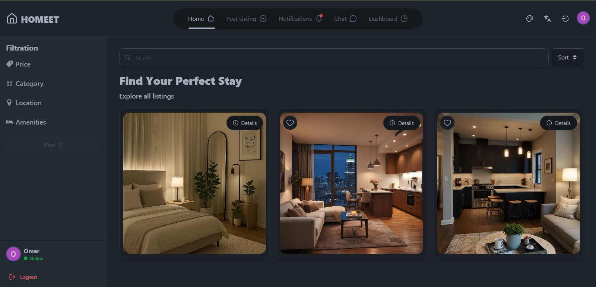
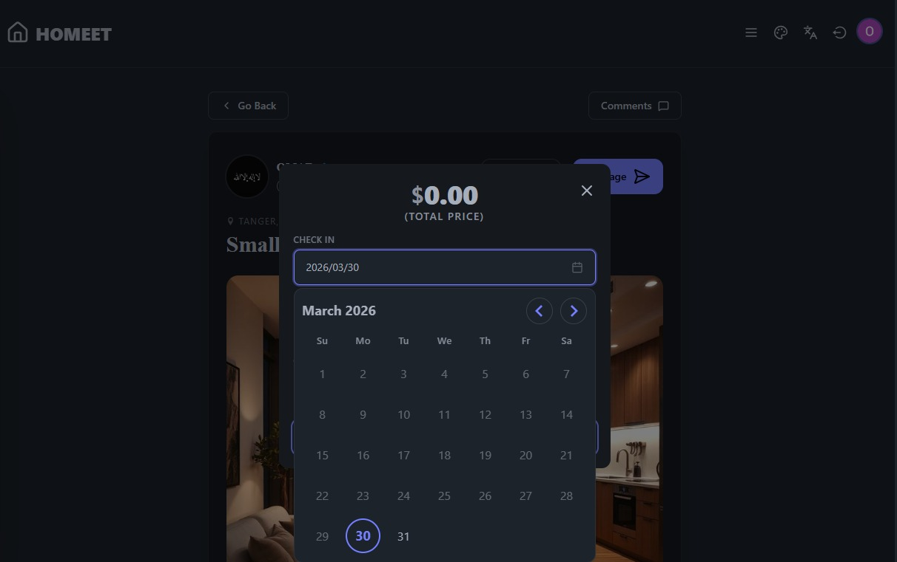
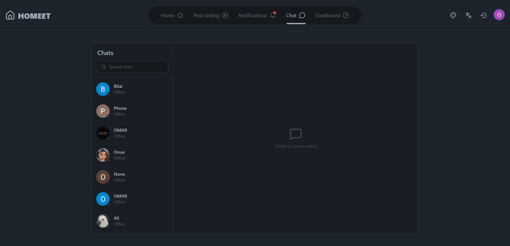
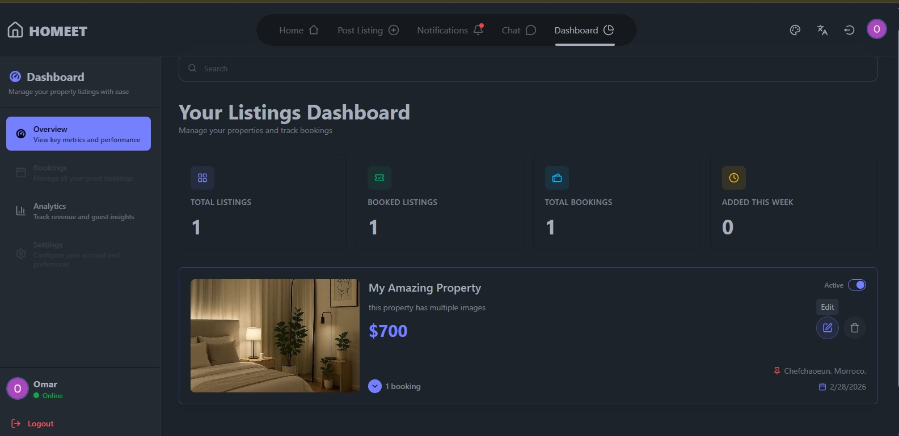

# 🏠︎ Real Estate Management & Messaging Platform

A full-stack, production-style real estate platform designed for agencies to manage property listings, communicate with clients in real time, and streamline internal workflows in a single unified system.

## ➤ Overview

This project simulates a real-world real estate agency system where listings, client inquiries, and communication are centralized into one platform.

It was built to demonstrate full-stack engineering skills, real-time architecture, advanced authentication systems, and scalable UI/UX design.

The goal is not just a CRUD project, but a functional SaaS-style product prototype for real estate operations.

## ➤ Key Features
### ✔️ Property Management System
- Create, update, and delete property listings
- Upload and manage multiple property images
- Search and filter listings efficiently
- Organized listing dashboard for quick access

### ✔️ Real-Time Communication
- Instant messaging using Socket.IO
- Private chat between clients and agents
- Live message updates without page refresh
- Online/offline awareness (if implemented)

### ✔️ Authentication & Security
- Secure login and registration system
- JWT-based authentication
- Protected routes for users and admins
- Password encryption using bcrypt

### ✔️ Admin / User Dashboard
- Centralized control panel
- Manage listings and conversations
- View system activity and interactions
- Clean, responsive UI for fast workflow

### ✔️ Performance & UX
- Responsive design for all devices
- Optimized API structure
- Fast and smooth user experience
- Modern UI focused on usability

### ✔️ Architecture Highlights
- Full-stack separation (Client / Server)
- REST API design with modular controllers
- Real-time WebSocket layer (Socket.IO)
- Scalable folder structure for maintainability
- Environment-based configuration

### ⚙️ Tech Stack
### Frontend


- Tailwind CSS  
- Axios  

---

### Backend


- Express.js  
- Socket.IO  

---

### Database
- MongoDB (Mongoose)  

---

### Authentication
- JWT (JSON Web Tokens)  
- bcrypt  

---

### ⚡ Demo
[Live Demo](https://homeet-seven.vercel.app)

### 📁 Project Structure
```
client/      → Frontend (React + UI)
backend/      → Backend (Express + API + Socket.IO)
```

### ⚙️ Getting Started
1. Clone repository
```git clone https://github.com/TheCodeDevX/Homeet.git``` 
```cd Homeet```

2. Install dependencies
**Backend**
cd server
npm install

Frontend
cd client
npm install

3. Environment variables

Create a .env file in /server:

PORT=8000
MONGO_URI=your_database_connection
JWT_SECRET=your_secret_key
CLIENT_URL=http://localhost:3000

4. Run project
Backend
npm run dev
Frontend
npm start
🧩 What Makes This Project Different

Unlike typical demo projects, this system is designed as a real operational tool concept for agencies:

Centralizes communication (instead of WhatsApp fragmentation)
Manages listings in one structured system
Enables real-time interaction between agents and clients
Mimics SaaS-level architecture

### 📈 Future Improvements
Advanced role-based permissions (Admin / Agent / Client)
WhatsApp notifications
Google Maps integration for properties

### 📸 Screenshots

Add images like:

#### Listings page


#### Booking


#### Chat interface


#### Chat interface


#### Dahboard 


## 💻 Author
 
**Omar Ryan**  
Full Stack Developer | React • Node.js • TypeScript • Socket.IO
 
[GitHub](https://github.com/TheCodeDevX) • [Email](mailto:omarrian3333@gmail.com)

🔥 Project Intent
This project was built to demonstrate:

Real-world full-stack engineering ability
SaaS thinking and product design
Scalable backend architecture
Real-time system implementation